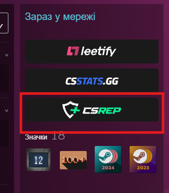

# CSrep-gg Extension for Millennium

A Millennium plugin that integrates a CSrep.gg profile button into the Steam client profile pages.

## Prerequisites

Before installing this plugin, ensure you have:

- **[Millennium](https://steambrew.app/)** installed and configured

### Example




### Millennium Library Manager

---

## Installation Guide

### Method 1: Millennium Plugin Installer (Recommended)

1. **Copy Plugin ID**

    Copy the following Plugin ID

2. **Install via Millennium**
    - Open Steam with Millennium installed
    - Go to **Millennium** → **Plugins**
    - Click on the **Install a plugin**
    - Paste the Plugin ID into the installer
    - Click **Install**
    - Restart Steam when prompted

### Method 2: Build from Source

#### Step 1: Clone the Repository

```bash
git clone https://github.com/TOR968/csrep-gg.git
cd csrep-gg
```

#### Step 2: Install Dependencies

```bash
bun install
```

#### Step 3: Build the Plugin

For development:

```bash
bun run dev
```

For production:

```bash
bun run build
```

#### Step 4: Install to Steam

**Option A: Copy to plugins directory**

```bash
# Windows
copy /R . "C:\Program Files (x86)\Steam\millennium\plugins\csrep-gg"

# Linux
cp -r . ~/.local/share/millennium/plugins/csrep-gg
```

**Option B: Create symbolic link (for development)**

```bash
# Windows
New-Item -ItemType Junction -Path "C:\Program Files (x86)\Steam\plugins\csrep-gg" -Target "d:\nnnn\csrep-gg"

# Linux/macOS
ln -s "$(pwd)" ~/.local/share/millennium/plugins/csrep-gg
```

#### Step 5: Enable Plugin in Steam

1. Completely close Steam (including system tray)
2. Restart Steam
3. Go to **Millennium** → **Plugins**
4. Enable "CSrep-gg"
5. Restart Steam once more

---

## How it works

The webkit bundle ([webkit/index.tsx](webkit/index.tsx)) runs inside the Steam community
browser and injects the button with a vanilla-DOM function
(`csrepGgInjectMain` in [webkit/inject.ts](webkit/inject.ts)). Settings are stored by a small Lua
backend ([backend/main.lua](backend/main.lua)) and edited from the plugin's settings panel
in the Steam client.

## Type checking

```bash
npx tsc -p frontend/tsconfig.json --noEmit
npx tsc -p webkit/tsconfig.json --noEmit
```

## Links

- [Millennium Framework](https://github.com/SteamClientHomebrew/Millennium)
- [CSrep.gg](https://csrep.gg)
- [Steam Client](https://store.steampowered.com/about/)
